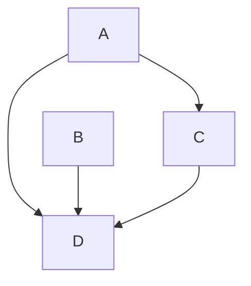

# Liens et ressources

|Site|Commentaire|Liens|
|-----|-----|-----|
|Scrum Guide||https://scrumguides.org|
|Roman Pichler – Product Management Blog||https://www.romanpichler.com/blog/|
|Scrum.org – PO Tips||https://www.scrum.org/resources/blog/tips-starting-product-owners|

> [!NOTE]
> Useful information that users should know, even when skimming content.

> [!TIP]
> Helpful advice for doing things better or more easily.

> [!IMPORTANT]
> Key information users need to know to achieve their goal.

> [!WARNING]
> Urgent info that needs immediate user attention to avoid problems.

> [!CAUTION]
> Advises about risks or negative outcomes of certain actions.

## Books

1. “Scrum Product Ownership: Balancing Value from the Inside Out” — Robert Galen
> [!NOTE]
>Exemples concrets, matrice de délégation, techniques avancées pour PO dans des environnements complexes.

2. “The Professional Product Owner: Leveraging Scrum as a Competitive Advantage” — Don McGreal & Ralph Jocham (Scrum.org)
> [!NOTE]
> Excellent lien entre théorie Scrum et les enjeux business concrets.

3. “Strategize: Product Strategy and Product Roadmap Practices for the Digital Age” — Roman Pichler
>[!NOTE]
> Aide à devenir un PO stratégique, pas seulement un gestionnaire de backlog.

4. “Inspired: How to Create Tech Products Customers Love” — Marty Cagan
>[!NOTE]
> Pourquoi le lire : Comprendre comment pensent les meilleurs PM/PO chez Google, Amazon, etc.

⸻

5. “Lean Product and Lean Analytics” — Ben Yoskovitz & Alistair Croll / Dan Olsen

>[!NOTE]
> Pour PO qui veulent allier agilité et expérimentation produit (A/B testing, métriques de traction, etc.).

⸻

6. Product Owner’s Handbook — Atacan Demiralp (celui que tu as)
>[!NOTE]
> Moins stratégique, peu d’approfondissement sur la gestion de la valeur ou les interactions politiques internes.

